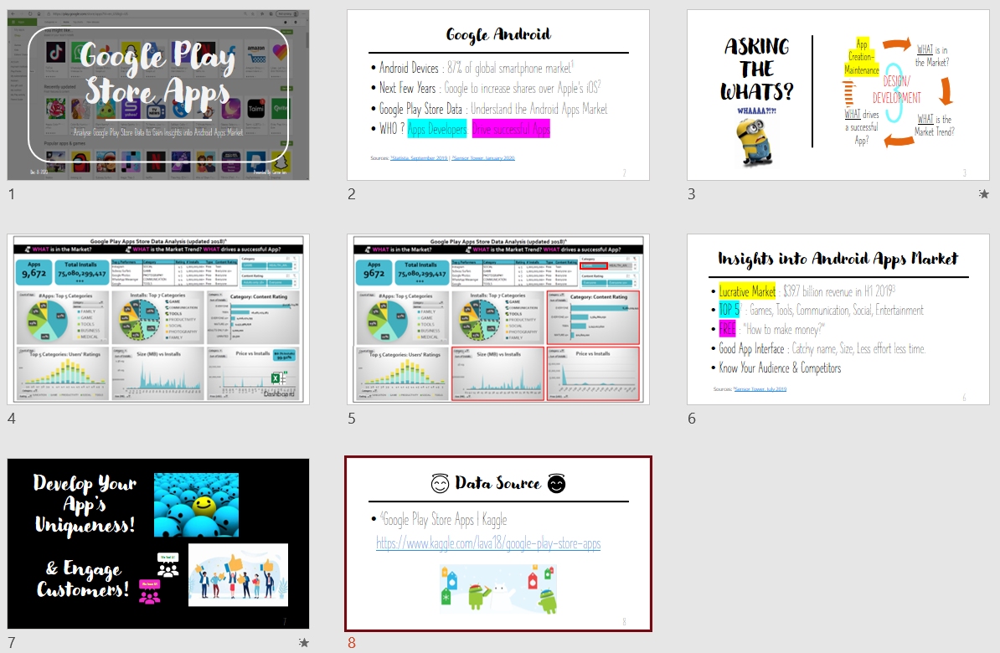
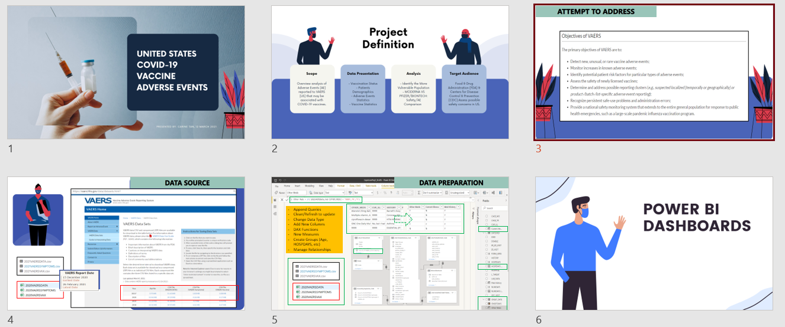
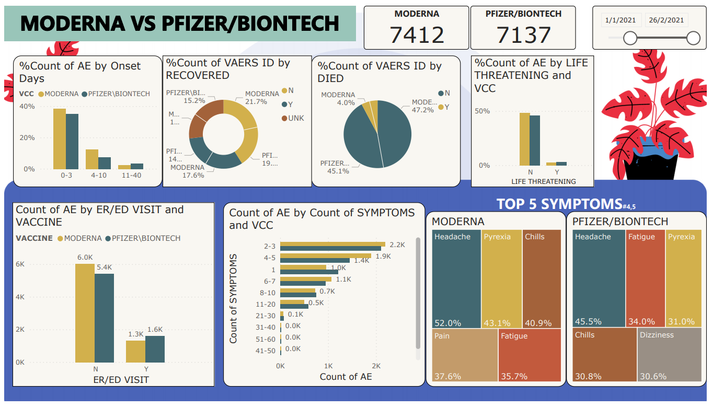
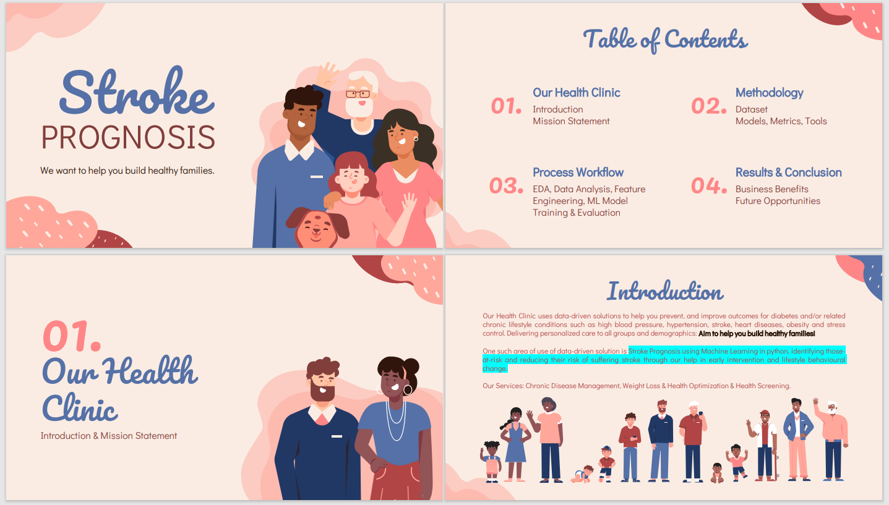

## Portfolio (Nov2020 - May2021)

---

### Capstone Project 0.1 [26-November-2020]

Capstone 0.1: Basic of Data Science - Research Presentation

"Research on articles about topics covered during the class:  
• Look for practical applications/use cases of data science   
• Identify the different aspects of the basics of data science application to that selected articles"

[Credit Card Fraud: Walk Through A Case Study](/pdf/Month0.1_Presentation.pdf)

My Experience: My Worst Attempt!

---

### Capstone Project 1 [08-December-2020]

Capstone 1: Creating Interactive Dashboards and Data Storytelling with Excel

"The Capstone Project will enable students to apply and integrate what they have learnt and give them an opportunity to delve in greater depth, into one or more of the topics covered in the Interactive Dashboards and Data Storytelling with Excel. Mentors and Associate Trainers will be assigned to guide the cohort. The capstone project should be completed within 6 days."

[Google Play Store Apps: 
Analyse Google Play Store Data to Gain Insights into Android Apps Market](/pdf/Capstone Project 1.pdf)

My Experience: Lesson learnt from Capstone 0.1, these presentation slides are kept simple, keypoints in bullet forms and also did practice runs before the actual presentation day.

Interesting Facts: Slide 3 the 'Design/Development cycle' & the concept of 'Uniqueness' were inspired when watching NCC Zone X 2020 online.   

---

### Capstone Project 2 [22-January-2021]

Capstone 2: Data Analysis using SQL & Creating Interactive Dashboard and Visualization using Excel Dashboards

"The Capstone Project will enable students to apply and integrate what they have learnt and give them an opportunity to delve in greater depth, into one or more of the topics covered in the Excel and SQL courses. Mentors and Associate Trainers will be assigned to guide the cohort. The capstone project should be completed within 10 days."

[Asia Covid-19 Statistics](/pdf/Capstone Project 2.pdf)

My Experience: The ideas didn't come all at once when I started on this Project. In actual fact, I started without a storyline. Things were in bits and pieces, yet God creatively put all these bits together, making it flow logically with none of my efforts and time put in go to waste. **YESHUA Is Good All The Time!**

Alias: 'The Most God's Ideas!'

[Blueprint](/images/Capstone2_Blueprint.jpeg)

---

### Capstone Project 3 [12-March-2021]

Capstone 3: PowerBI Interactive Dashboard

"The Capstone Project will enable participants to apply and integrate what they have learnt and give them an opportunity to delve in greater depth, into one or more of the topics covered in the ‘Analysing and Visualizing Data with PowerBI’ course. Mentors and Associate Trainers will be assigned to guide the cohort. The capstone project should be completed within 10 days."

[United States Covid-19 Vaccine Adverse Events](/pdf/Capstone Project3.pdf)

[PowerBI Dashboards](/pdf/CapstoneProj3_Draft5.pdf)

My Experience: This is my favourite of the 5 projects! Though throughout the preparation even up till presentation, I had the constant nagging feeling that it is missing something - I've not figured out what it is. Hopefully, someday I would! 

My Audacity: I asked God to 'patent' the ideas in this project; No other will wrangle the data like I did! O-O #Originator

[Blueprint](/images/Capstone3_Blueprint.jpeg)

---

### Capstone Project 4 [07-May-2021]

Capstone 4: Machine Learning using Python

"The Capstone Project will enable students to apply and integrate what they have learnt and give them an opportunity to delve in greater depth, into one or more of the topics covered in the Machine Learning using Python courses. Mentors and Associate Trainers will be assigned to guide the cohort. The capstone project should be completed within 5 days."

[Stroke Prognosis](/pdf/Family Care-Stroke Prognosis(5).pdf)

[Model Selection (without Feature Engineering)](/Model_Selection_Stroke_Prognosis_(w_o_feature_engineering).ipynb)

[Model Selection (with Feature Engineering)](/Model_Selection_Stroke_Prognosis_(feature_engineering).ipynb)

My Experience: Played it very safe on the selection of my dataset (a manageable one) in view of the tight timeline and lack of adequacy in Algorithms in Python. Also picked the most uncommonly used color theme in presentations, 'Pink!', and 'Family' as my theme for this project.

Truth Be Told: Too much of pink can be overwhelming! Not my best project!

[Blueprint](/images/Capstone4_Blueprint.jpeg)

---

_CREDITS: Source of the Course Descriptions are not originated from me, they are taken from course materials provided on Canvas Portal by NTUC LearningHub._ 

---

Page template forked from <a href="https://github.com/evanca/quick-portfolio">evanca</a>

<!-- Remove above link if you don't want to attibute -->
